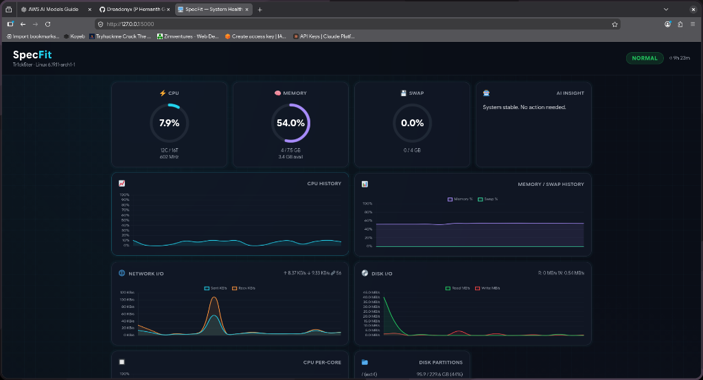
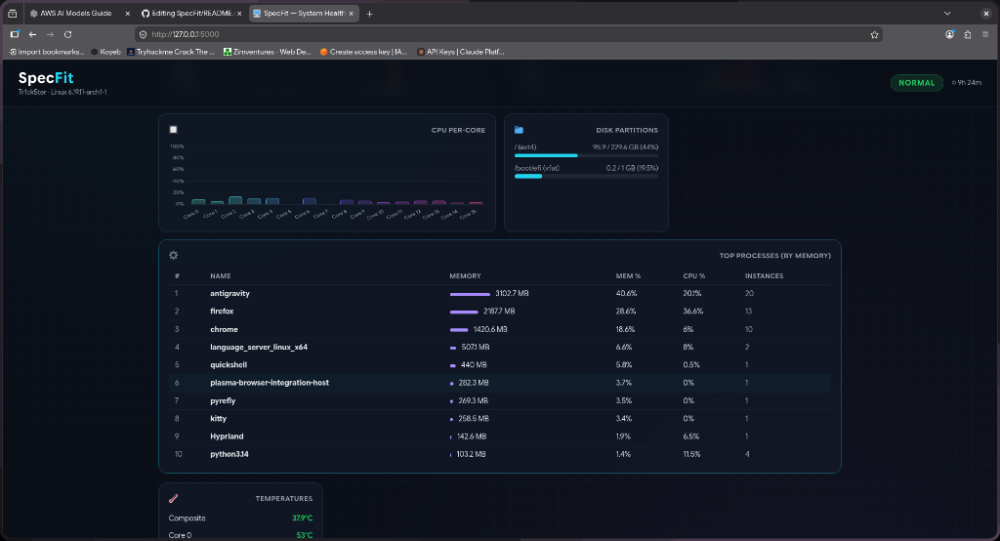

# SpecFit 🖥️

> AI-powered system health monitor with real-time CPU/memory analysis

Not just CPU and RAM percentages — SpecFit classifies your system into one of three health states and uses **Groq AI** to explain what's happening in plain language.




---

## Health States

| State | What it means |
|---|---|
| 🟢 **NORMAL** | All good |
| 🟡 **STRAINED** | Under pressure, watch it |
| 🔴 **OVERLOADED** | Something needs attention |

---

## Features

- **Real-time monitoring** — CPU + memory usage via psutil
- **AI-powered insights** — Groq LLaMA 3.1 explains what's happening and what to do
- **Process tracking** — Identifies the top memory-consuming process (aggregated by name)
- **Health classification** — Considers both CPU and memory for verdicts
- **Dark-themed dashboard** — Clean, minimal UI with animated progress bars

---

## Setup

```bash
git clone https://github.com/Dreadonyx/SpecFit.git
cd SpecFit
pip install -r requirements.txt

# Configure your Groq API key
cp .env.example .env
# Edit .env and add your key from https://console.groq.com

python app.py
```

Open `http://localhost:5000`.

---

## How It Works

1. `/status` endpoint reads real-time CPU and memory via `psutil`
2. Aggregates memory usage by process name to find the top consumer
3. Classifies system health based on thresholds:
   - CPU > 90% or Memory > 85% → **OVERLOADED**
   - CPU > 70% or Memory > 70% → **STRAINED**
   - Otherwise → **NORMAL**
4. For non-normal states, sends context to **Groq LLaMA 3.1** for a human-readable explanation
5. Returns everything as JSON → rendered in the dashboard UI

---

## API

```
GET /          → Dashboard UI
GET /status    → JSON system health data
```

### Sample `/status` Response

```json
{
  "cpu_usage": 30.8,
  "memory_usage": 79.8,
  "memory": {
    "used_gb": 6.0,
    "free_gb": 0.2,
    "available_gb": 1.5
  },
  "top_process": {
    "name": "chrome",
    "memory_gb": 1.96
  },
  "verdict": "STRAINED",
  "ai_insight": "1. chrome is using high memory.\n2. Close chrome if not in use or restart.\n3. Refresh status again to check."
}
```

---

## Project Structure

```
SpecFit/
├── app.py              # Flask backend + Groq AI integration
├── requirements.txt    # Python dependencies
├── .env.example        # API key template
├── static/
│   ├── style.css       # Dark-themed dashboard styles
│   └── app.js          # Frontend fetch + rendering
└── templates/
    └── index.html      # Dashboard layout
```

---

## Stack

- **Python / Flask** — Backend + API
- **psutil** — System metrics
- **Groq API** (LLaMA 3.1 8B) — AI-powered health insights
- **Vanilla HTML/CSS/JS** — Frontend dashboard

---

## Author

**Dreadonyx** — [github.com/Dreadonyx](https://github.com/Dreadonyx)
